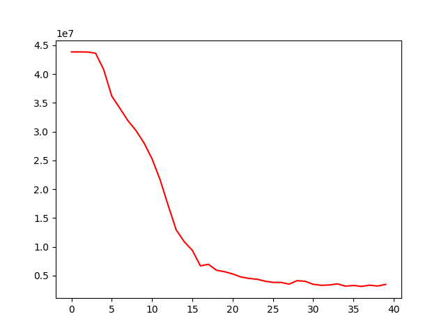

## Machine learning project, Mercantec, Viborg 2020
I made this project for a machine learning course.  
It includes a scraper for scraping Bang & Olufsen ads from DBA and a module for predicting prices for your own Bang & Olufsen ads.

This project was create over a period of 4 days,

### By: Casper P
#### Teacher: Jakup Wenningsstedt
#### School: Mercantec, Viborg, Denmark

---
### **Setup**

Install the needed requirements from requirements.txt, do a DBA scrape, train your model and try to predict a price.

Confirm on DBA that your price looks right.. If it's too out of touch with reality, your initial weights might have been faulty. If that's the case, delete your model `rm data/model.h5` and run training again.

An example of the normal learning curve:

<!--  -->

---
To add new models to the predictor, add them in both `data/allowed_models.json` and `data/dummy_columns.json` 
